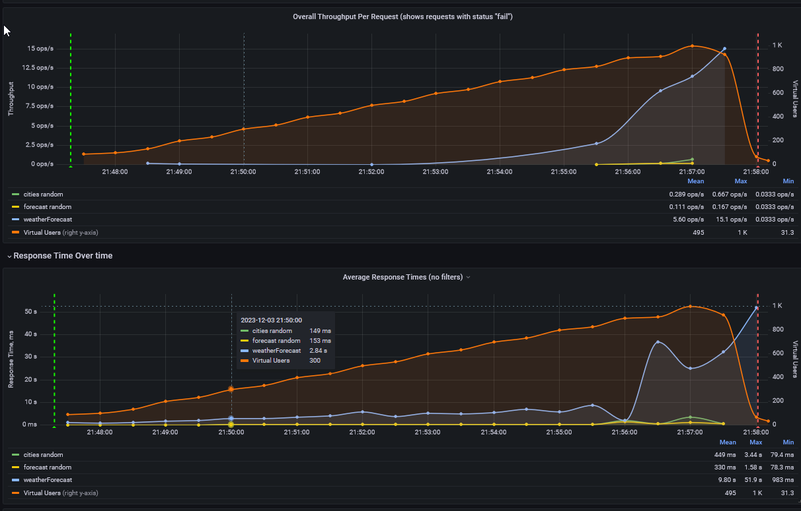
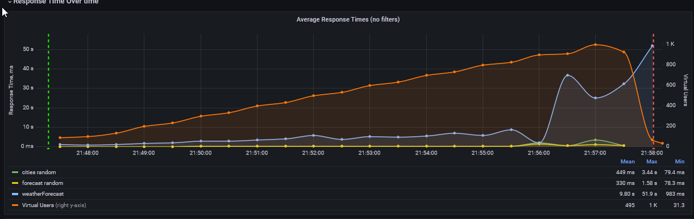
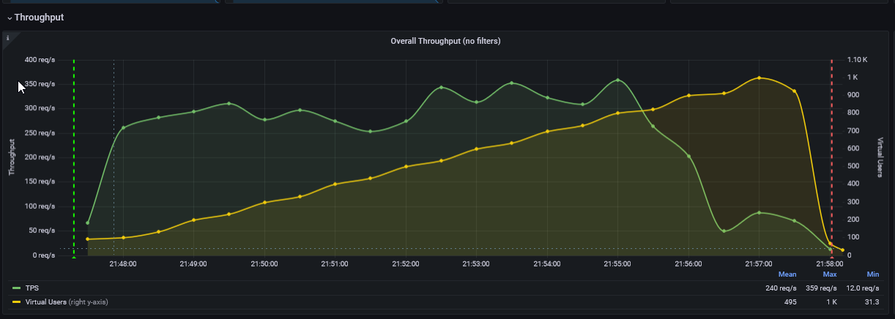
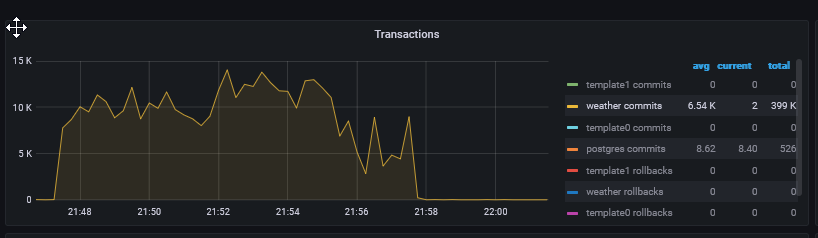
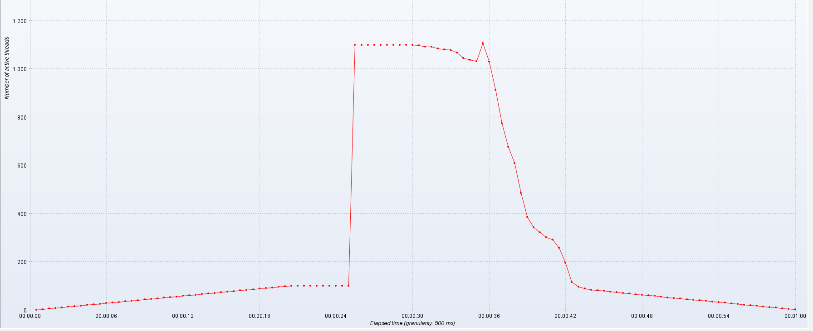
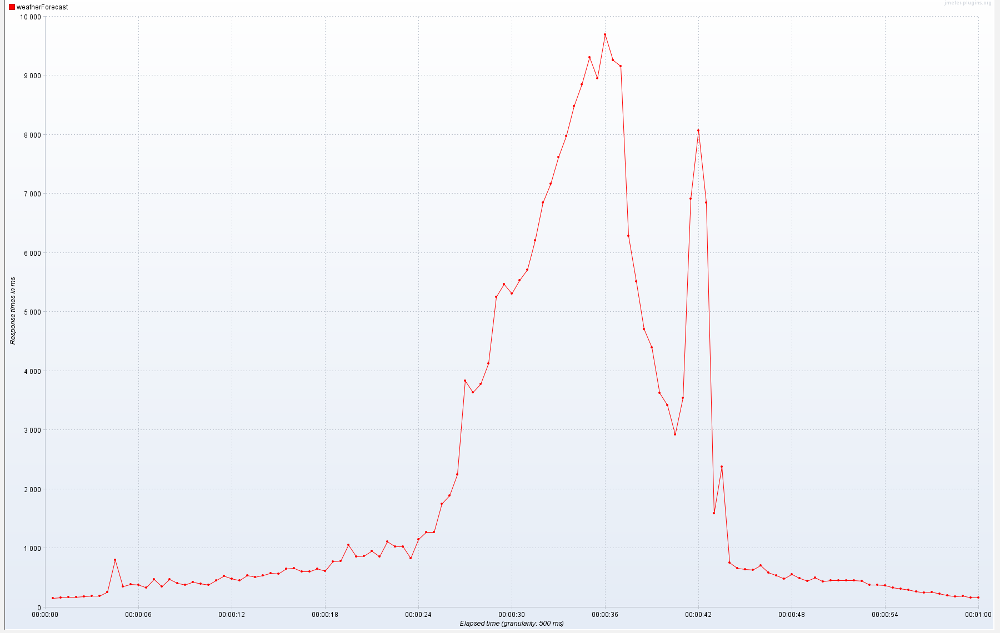

# Load Testing weather forecast

## Описание установки

Система состоит из: 
1. 2 сервера БД 2 cpu/8 ram (postgresql + patroni)
2. 1 сервер балансировки 4 cpu/8 ram
3. 3 сервера etcd 

Для тестов в базе данных были созданые 50 городов 150 прогнозов (скрипт `generator.py`)
Сервис - WeatherForecast API, основной endpoint - `weatherForecast` - отдает информацию о прогнозах по всем городам. 
Также имеются дополнительные endpoint'ы - `cities/{id}`, `forecast/{id}`, для них есть возможно выполнять запросы `GET, POST, PUT`
## Профиль нагрузки 
Будут проведены два теста - поиск максимальной пропускной способности и проверка стабилности системы при резкой нагрузке
Для поиска максимальной производительности используется следующий профиль:
- Тест 10 минут, повышение количества поток с 0 до 1000 постепенной

Для проверки стабильности следующий сценарий:
- Тест 10 минут, плавный выход до 500 потоков, работа в таком режиме 10 минут 

Дополнительно: 
- Тест 5 минут, выход на 300 потоков, резкий пик до 900, возвращение до 300 
## Разработка скрипта
Для проведения теста использован Jmeter + плагин для экспорта данных в InfluxDBv2 
- [Jmeter dashboard](http://5eca9364-3899-4021-b861-fd4f64e48c6d.mts-gslb.ru/d/b4kP_KoMzasadasdasd/jmeter-load-test-org-md-jmeter-influxdb2-visualizer-influxdb-v2-0-flux?orgId=1&refresh=1m&from=1701629939563&to=1701630839563)
- [PG database dashboard](http://5eca9364-3899-4021-b861-fd4f64e48c6d.mts-gslb.ru/d/000000039mfesenko/postgresql-database?orgId=1&var-DS_PROMETHEUS=mfesenkoProm&var-interval=%24__auto_interval_interval&var-namespace=&var-release=&var-instance=10.0.10.3%3A9187&var-datname=All&var-mode=All&from=1701629203726&to=1701630091653)
## Определение SLA / SLO 

Соглашение об уровне обслуживания (SLA):
- Время отклика SLA: среднее время отклика по всем endpoints (weatherForecast, cities random, forecast random) не более 4 секунд.
- Uptime SLA: время безотказной работы 99,9 % 
- SLA Error Rate: общий уровень ошибок не должен превышать 0,1 % для всех endpoints.

Цели уровня обслуживания (SLO):

- Конечная точка weatherForecast:
  - Время отклика SLO: стремиться к среднему времени отклика в 5 секунды (5000 миллисекунд) для endpoint weatherForecast.
  - Время безотказной работы SLO: стремиться к времени безотказной работы 99,95 % 
  - Уровень ошибок SLO: Поддерживать уровень ошибок ниже 0,05 %

## Тесты

1. Тест 1 - Максимальная производительность
- [JMeter Dashboard](http://5eca9364-3899-4021-b861-fd4f64e48c6d.mts-gslb.ru/d/b4kP_KoMzasadasdasd/jmeter-load-test-org-md-jmeter-influxdb2-visualizer-influxdb-v2-0-flux?orgId=1&var-request=weatherForecast&var-aggregation=30&var-runId=All&var-samplerType=All&from=1701629226692&to=1701629890737)

- При превышении 800 потоков (vusers) начинается деградация системы, выраженная в увеличении времени ответа с 8с до 30+с.
При этом происходит увеличение ошибок и Pod's начинают перезапускаться. Пропускная способность уменьшается до 50 req/s

- Время ответа `weatherForecast ` линейно растет от количества активных потоков

100 threads = 1s, 400 threads = 4s, 800 threads = 8s

- Пропусканя способность (RPS) MEAN - 240 req/s, MAX - 359 req/s, MIN - 12/req/s

- Инстанс базы данных сильно нагружается (80% CPU), наблюдается высокое количество transactions 

2. Тест 2 - стабильость работы 

- [Jmeter Dashboard](http://5eca9364-3899-4021-b861-fd4f64e48c6d.mts-gslb.ru/d/b4kP_KoMzasadasdasd/jmeter-load-test-org-md-jmeter-influxdb2-visualizer-influxdb-v2-0-flux?orgId=1&from=1701630294712&to=1701631111922)
- При стабильной нагрузке в 500 threads система ведет себя предсказуемо
- Средний RPS 300, при 500 threads время ответа около 5с 

3. Тест 3 - пиковая нагрузка

- Резкое повышение нагрузки с 100 threads -> 1100 не вызывает ошибок при ответах. Система отрабатывает корректно с увеличением времени ответа

## Общий вывод

Исходя из полученной информации можно сделать вывод, что система корректно отрабатывает при нагрузке в 500 threads, при этом превышение этого показателя 
приводит к выходу из рамок SLO/SLA, основной запрос `weatherForecast` необходимо оптимизировать на предмет работы с БД, так как он вызывает большое количество транзакций

